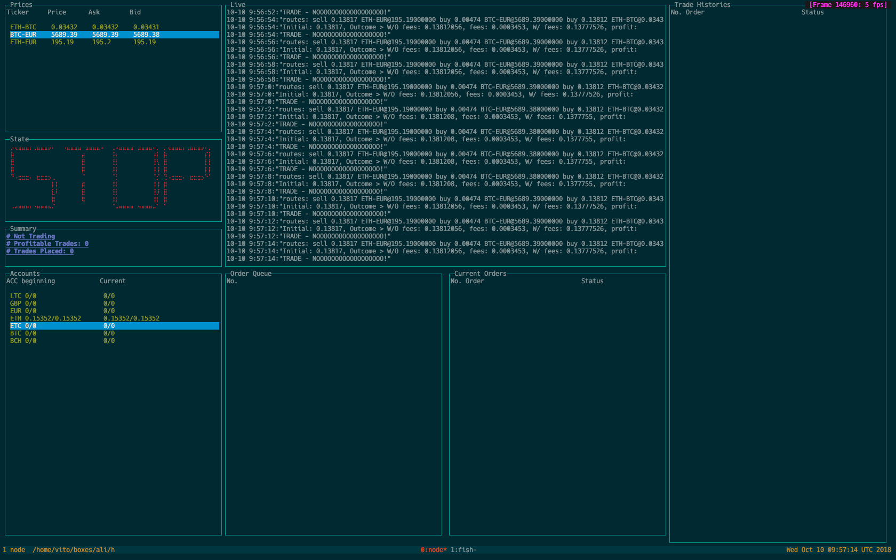

# High Frequency Triangulation Trading Bot

<center>
	
</center>

# Intro

This is a Crypto currency triangulation bot

At the moment it only support GDax, however its designed to support multiple exchanges in mind

The basic idea is to find the prices discrepancy between currency pairs.

E.g 

If the current market have the following quote

GBP/USD - 1.32

USD/EUR - 0.87 

EUR/GBP - 0.87

If you only have GBP, you can go to the market and do the following 

1. Use your GBP to buy USD, say you have £100 (GBP), then you convert it into $132 (USD)

2. Use your USD to buy EUR, your $132 (USD) will get you 132 * 0.87 = 114.84 (EUR)

3. Use EUR to buy GBP, 114.84 * 0.87 = 99.9108 (GBP)

As you can see at the begining you have £100 (GBP), after the trades you end up with £99.9108 (GBP), so this is not a profitable trade - DON'T DO IT

But the currency market change all the time, so times there might be opportunities to do the trade, if the currenct market with the following quotes

GBP/USD - 1.32

USD/EUR - 0.87 

EUR/GBP - 0.89

Then your trades will be come

1. Use your GBP to buy USD, say you have £100 (GBP), then you convert it into $132 (USD)

2. Use your USD to buy EUR, your $132 (USD) will get you 132 * 0.87 = 114.84 (EUR)

3. Use EUR to buy GBP, 114.84 * 0.89 = 102.2076 (GBP)

Now you have more money then you started

Obviously prices discrepancy doesn't happen all the time.

So this bot is trying to find a profitable trades and execute it every second.

# Installation

```sh
npm install
```

# Usage

Make sure you familiar with [Triangulation](https://en.wikipedia.org/wiki/Triangular_arbitrage).

Basically it will involve at least 3 currency pairs

1. Set up your currency pair in `index.js`

2. Set up your GDax api credential - fill it in `config.json` (Change `config-sample.json` to `config.json`)

# License

Do whatever you want!
